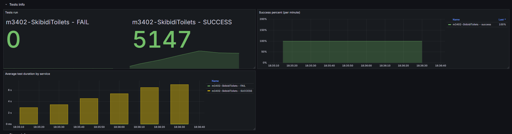
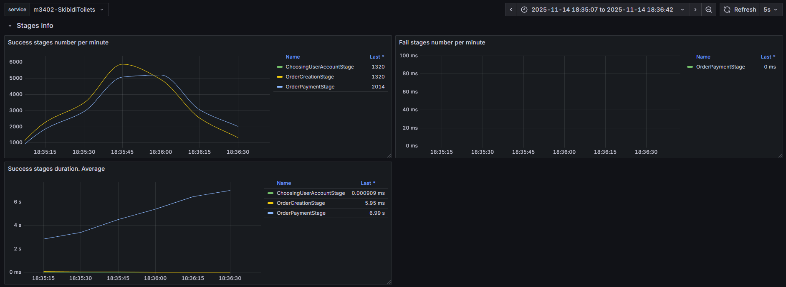
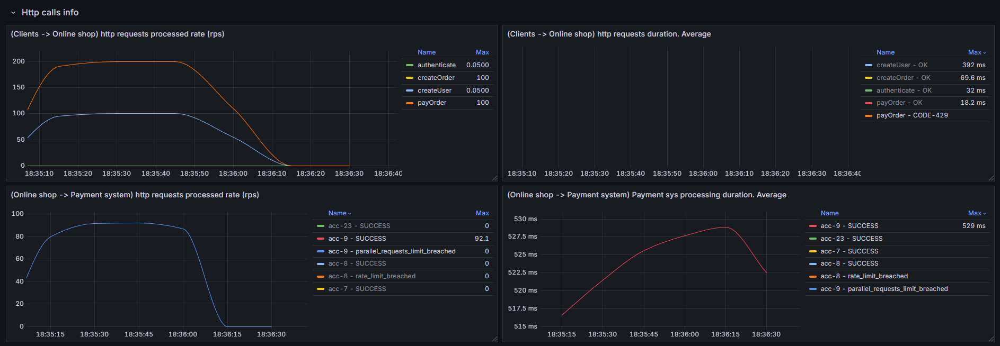

параметры системы оплаты:

PaymentAccountProperties(serviceName=m3402-SkibidiToilets, accountName=acc-9, parallelRequests=50, rateLimitPerSec=120, price=30, averageProcessingTime=PT0.5S, enabled=true)

Результаты:





Доработки:

Размер тредпула выставляем из следующих соображений:
производительность одного потока = 1 / время обработки одного запроса = 1 / 0.5 = 2

Это значит, что 1 поток способен дать нам 2 rps, а чтобы добиться запрашиваемых 100 rps, нам нужно 50 таких потоков

```kotlin
fun calcPoolSize(): Int {
    val requestedRps = 100
    val singleThreadPerfomance = 1 / 0.5 // 1 / averageProcessingTime
    return (requestedRps / singleThreadPerfomance).toInt()
}
```